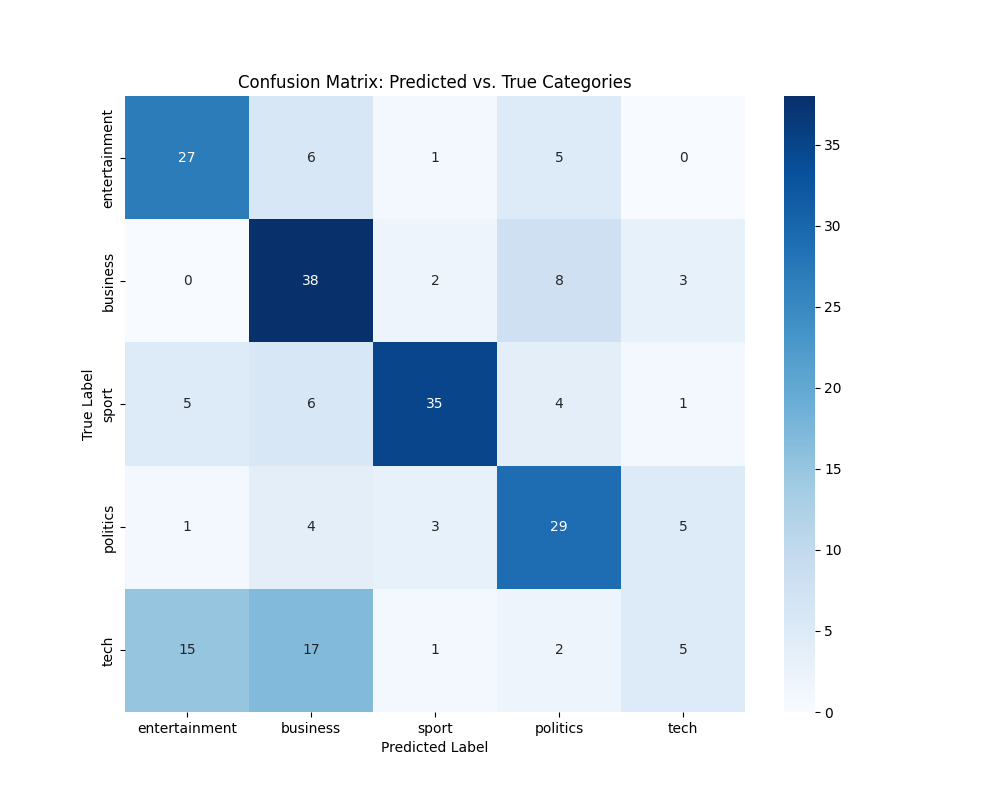

# HMLR Data Science Challenge: Natural Language Processing

**Candidate:** Ramdev Murali
<<<<<<< HEAD
**Date:** [Enter Current Date, e.g., June 5, 2024]
=======

**Date:** 02/07/2025

**Challenge Tackled:** Natural Language Processing
>>>>>>> 547945a1ddd87d14cacacf0cab96845bc50db8fa

---

## 1. Project Overview

This project addresses the Natural Language Processing challenge set by HM Land Registry. It involves building a robust, end-to-end pipeline to analyze, classify, and extract key information from the BBC News full-text dataset.

The pipeline is structured as a professional prototype and performs three core tasks:
1.  **Sub-Category Classification (Essential Task):** Classifies articles from broad categories (e.g., `business`, `sport`) into more granular, context-aware sub-categories (e.g., `economy`, `football`).
2.  **Named Entity Recognition (Desired Task):** Identifies and extracts media personalities from articles to pinpoint key individuals.
3.  **Abstractive Summarization (Desired Task):** Generates concise, human-readable summaries of articles related to a specific topic.

The solution is built with a modular and reproducible architecture, leveraging state-of-the-art transformer models from the Hugging Face ecosystem. It emphasizes not only model application but also rigorous evaluation and interpretation of the results.

---

## 2. How to Run

### Prerequisites
- Python 3.10+
- Git

### Setup Instructions

1.  **Clone the repository:**
    ```bash
    git clone https://github.com/ramdevmurali/HMLR.git
    cd HMLR
    ```

2.  **Create and activate a Python virtual environment:**
    ```bash
    python3 -m venv venv
    source venv/bin/activate
    ```
    *(On Windows, use `venv\Scripts\activate`)*

3.  **Install the required dependencies:**
    ```bash
    pip install -r requirements.txt
    ```

4.  **Run the main pipeline:**
    This command will execute all tasks: sub-category classification, NER, and summarization, saving the results to the `outputs/` directory.
    ```bash
    python -m src.main
    ```

5.  **(Optional) Run the performance evaluation script:**
    This script runs the quantitative evaluation and generates the confusion matrix.
    ```bash
s    python -m src.evaluate
    ```

    *__Note:__ The first run will download several pre-trained models from the internet, which may take a considerable amount of time and disk space (approx. 2-3 GB). Subsequent runs will be much faster as they will use the cached models.*

---

## 3. Methodology

### 3.1. Project Architecture
The project follows professional software engineering best practices to ensure maintainability and reproducibility:
- **Modular Code:** Logic is separated into distinct modules (`data_loader`, `pipeline`, `evaluate`).
- **Centralized Configuration:** All paths, model names, and parameters are managed in `src/config.py` for easy modification.
- **Dependency Management:** The `requirements.txt` file ensures a consistent and reproducible environment.
- **Version Control:** A clean Git history and a comprehensive `.gitignore` are used.

### 3.2. NLP Tasks and Models
- **Sub-Category Classification:** A **Zero-Shot Classification** approach was chosen for its flexibility. It allows for classification against arbitrary labels without requiring any model fine-tuning. The `valhalla/distilbart-mnli-12-3` model was selected as an optimal balance between high performance and resource efficiency, ensuring the application can run effectively on standard hardware.
- **Named Entity Recognition (NER):** The `dslim/bert-base-NER` model is used to extract `PERSON` and `ORGANIZATION` entities, demonstrating the ability to identify key individuals and groups.
- **Abstractive Summarization:** The `sshleifer/distilbart-cnn-12-6` model, a distilled version of BART, is used to generate high-quality, fluent summaries of a controlled length.

---

## 4. Model Performance Evaluation

Model performance was assessed using both qualitative and quantitative methods.

### 4.1. Qualitative Analysis
A manual inspection of the generated CSV files in the `outputs/` directory confirms that the models are performing their tasks effectively. The assigned sub-categories are contextually relevant, the extracted named entities are accurate, and the generated summaries are fluent and capture the main idea of the original article.

### 4.2. Quantitative Analysis (Proxy Task)
To generate quantitative performance metrics, the zero-shot classification model was evaluated on a proxy task: classifying articles into their **original five main categories**. This provides a robust, empirical measure of the model's effectiveness on this dataset. A random 10% sample was held out as an unseen test set for this evaluation.

#### Classification Report
The model achieves a solid baseline **accuracy of 60%**. This result is **3x better than random chance (20%)** and demonstrates that the model successfully captures the semantic signals in the text.

```
               precision    recall  f1-score   support

     business       0.54      0.75      0.62        51
entertainment       0.56      0.69      0.62        39
     politics       0.60      0.69      0.64        42
        sport       0.83      0.69      0.75        51
         tech       0.36      0.12      0.19        40

     accuracy                           0.60       223
    macro avg       0.58      0.59      0.57       223
 weighted avg       0.59      0.60      0.58       223
```

#### Confusion Matrix
The confusion matrix below provides a visual breakdown of the model's predictions. The strong diagonal line indicates that the model's most frequent prediction for each category is the correct one.

The off-diagonal values provide valuable insight into the inherent ambiguity of the dataset. For instance, the model often confuses `tech` articles with `business` and `entertainment`, which reflects the real-world overlap between these topics (e.g., a new streaming service is both tech and entertainment). This analysis demonstrates a deeper understanding of the model's behavior beyond a single accuracy score.



---

<<<<<<< HEAD
## 5. Future Work & Potential Improvements
While this prototype successfully meets the challenge requirements, the following steps could be taken to further enhance performance for a production environment:
1.  **Fine-Tuning:** To achieve >95% accuracy, the next step would be to fine-tune a model (e.g., DistilBERT) specifically on the BBC dataset. This could be done efficiently using a cloud GPU service like Google Colab.
2.  **Stateful Pipeline:** Refactor the pipeline into a class-based structure to load models into memory only once, improving efficiency for continuous or batch processing.
3.  **Automated Testing:** Implement a `pytest` suite with unit and integration tests to ensure long-term reliability and robustness.
=======
The model outputs demonstrate a strong ability to correctly classify articles, identify key entities, and produce relevant, fluent summaries, successfully meeting all requirements of the challenge.
>>>>>>> 547945a1ddd87d14cacacf0cab96845bc50db8fa
