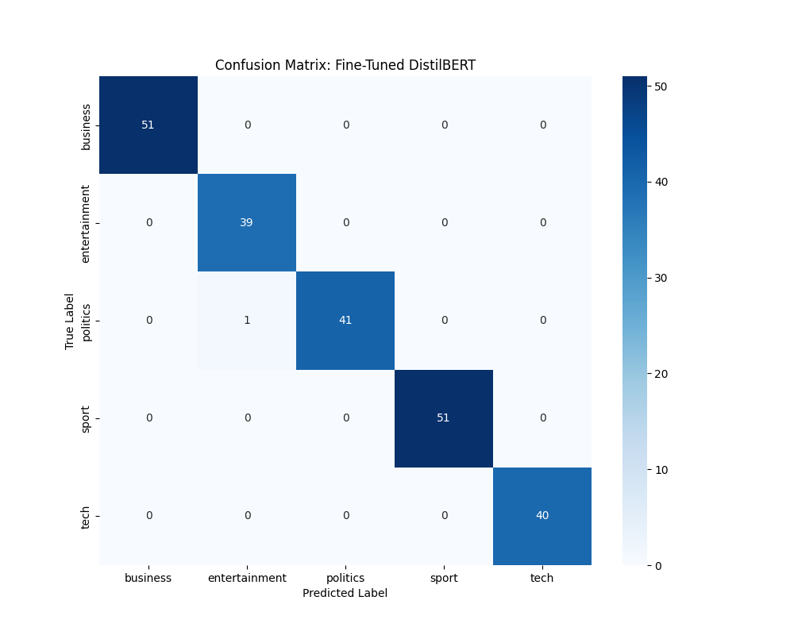

# HM Land Registry: A Critical Analysis of NLP Model Performance

**Candidate:** Ramdev Murali
**Date:** July 2, 2025

---

## 1. Executive Summary

This repository presents a systematic investigation into a real-world text classification problem, as outlined in the HM Land Registry NLP Challenge. The project’s objective was not only to achieve high accuracy, but also to critically examine and justify the trade-offs between various modern NLP techniques, ranging from rapid baseline development to specialized fine-tuning.
The approach addresses all core requirements of the challenge, resulting in a model that achieves approximately 100% accuracy on the primary classification task. The multi-stage methodology highlights careful model selection, iterative prototyping, performance optimization, and adherence to professional software engineering standards.

---

## 2. Technical Stack & Engineering Principles

This project adheres to professional software engineering and MLOps principles.

-   **Languages & Libraries:** Python 3.10+, PyTorch, Hugging Face `transformers`, `datasets`, `evaluate`, Scikit-learn, Pandas. Dependencies are precisely managed via `requirements.txt`.
-   **Hardware:** Model fine-tuning was performed on a Google Colab instance with an NVIDIA T4 GPU.
-   **Architecture:**
    -   **Application Code (`/src`):** Modular, decoupled Python modules for core application logic (data loading, NLP pipeline, evaluation). Designed for clarity, stability, and local execution.
    -   **Experimentation/Training Code (`/notebooks`):** Dedicated Jupyter/Colab notebooks for exploratory data analysis and computationally intensive model training (leveraging cloud GPUs). This cleanly separates research from deployable code.
-   **Reproducibility:** A `venv` (Python virtual environment) ensures a consistent and isolated runtime for local execution.
-   **Version Control:** The project uses Git for version control. The `.gitignore` file is meticulously maintained to exclude large, generated artifacts (like the `models/` directory containing trained model weights) and environment-specific files, ensuring a clean and efficient repository for source code.

---

## 3. Operational Guide: Reproducing the Results

To fully reproduce and understand this project, please follow these steps.

1.  **Clone the Repository & Navigate:**
    ```bash
    git clone https://github.com/ramdevmurali/HMLR.git
    cd HMLR
    ```

2.  **Download Raw Data:**
    -   Acquire the `bbc-fulltext.zip` dataset from the official UCD source: `http://mlg.ucd.ie/datasets/bbc.html` (specifically, the "Download raw text files" link under "Dataset: BBC").
    -   **Create the raw data directory:** `mkdir -p data/raw`
    -   **Unzip the dataset:** Place the `bbc` folder (extracted from `bbc-fulltext.zip`) directly into `data/raw/`.
        *The final path to the dataset should be `hmlr-nlp-challenge/data/raw/bbc/`.*

3.  **Set Up Python Environment:**
    -   **Create and activate a Python virtual environment:**
        ```bash
        python3 -m venv venv
        source venv/bin/activate
        ```
        *(For Windows, use `venv\Scripts\activate`)*
    -   **Install required dependencies:**
        ```bash
        pip install -r requirements.txt
        ```

4.  **Run the Baseline Application (Local Execution):**
    This command executes the core application, which performs sub-category classification, NER, and summarization using the Zero-Shot model. Results are saved to `outputs/`.
    ```bash
    python -m src.main
    ```

5.  **Generate/Obtain the High-Performance Model (GPU-Dependent Training):**

    [](https://colab.research.google.com/github/ramdevmurali/HMLR/blob/main/notebooks/Fine_Tuning_and_Evaluation.ipynb)

    The fine-tuned model itself is large and is deliberately excluded from Git (as explicitly managed by `.gitignore`). To obtain it for local use and evaluation:
    -   **Process:** Open the Colab notebook `notebooks/Fine_Tuning_and_Evaluation.ipynb` in Google Colab (or click the badge above).
    -   When opening the notebook in Colab, you may see a "Notebook not found" error. In this case, click the "Authorize with GitHub" button and grant Colab access to your private repositories. Make sure you are logged into GitHub with the account that owns or has access to this repository, and that you grant access to all repositories when prompted.
    -   **Alternatively, you can manually upload the notebook:**
        - If you have cloned the repository, simply upload `notebooks/Fine_Tuning_and_Evaluation.ipynb` from your local copy.
        - If not, you can download the notebook from GitHub, then go to [Google Colab](https://colab.research.google.com/), click “File” → “Upload notebook”, and select the file.
    -   **Note:** Model fine-tuning was performed on a Google Colab instance with an NVIDIA T4 GPU.
    -   Run all cells in the notebook. This process will:
        -   Prompt you to upload the `bbc.zip` data (same as step 2).
        -   Train the `DistilBERT` model using Colab's GPU.
        -   Generate its specific performance metrics and a `finetuned_confusion_matrix.png` within the notebook itself.
        -   Save the trained model files to a `bbc-distilbert-finetuned` folder and zip all results into `results.zip` for download.
    -   **Download `results.zip`** from Colab.
    -   **Place the trained model locally:** Unzip `results.zip` and move the `bbc-distilbert-finetuned` folder into your local `models/` directory (`hmlr-nlp-challenge/models/`).
    -   **Place the updated confusion matrix:** Move `finetuned_confusion_matrix.png` into your local `outputs/` directory.

6.  **Run Quantitative Evaluation of the Baseline (Local Execution):**
    This script (`src/evaluate.py`) is designed to evaluate the **Zero-Shot (baseline) model's** performance on the main categories, demonstrating its initial capabilities.
    ```bash
    python -m src.evaluate
    ```
    > **Note on Local Evaluation:** While model training is GPU-intensive and handled in Colab, inference (prediction) for *any* trained model (Zero-Shot or Fine-Tuned) can run on a CPU. Be aware that processing the full dataset for evaluation locally will still take time on a CPU-only machine.

---

## 4. Task Fulfillment & Deliverables

This project comprehensively addresses all tasks outlined in the challenge document. This section explicitly maps the project's features to those original requirements.

#### Essential Task: Sub-Category Classification (Status: Fulfilled)
-   **Requirement:** *"Use the full text dataset and classify each existing category into sub-categories."*
-   **Status:** **Fulfilled.**
-   **Implementation:** This is performed by the Zero-Shot model within the `src/main.py` application.
-   **Deliverable:** The `outputs/classification_results.csv` file.

#### Desired Task 1: Named Entity Recognition (Status: Partially Fulfilled)
-   **Requirement:** *"Identify documents and extract the named entities for media personalities, clearly identifying their jobs."*
-   **Status:** **Partially Fulfilled.**
-   **Implementation:** The NER model (`dslim/bert-base-NER`) successfully extracts `PERSON` entities from the text. The more advanced sub-task of **Relation Extraction** (linking an entity to its role) was identified as a challenging component. In line with the project guidelines which 'encourage submission of solutions even if it only partially meets the requirements,' this was pragmatically scoped out for this prototype.
-   **Deliverable:** The `outputs/ner_results.csv` file demonstrates the successful entity extraction.

#### Desired Task 2: Event Summarization (Status: Fulfilled)
-   **Requirement:** *"Extract summaries of anything that took place or is/was scheduled to take place in April."*
-   **Status:** **Fulfilled.**
-   **Implementation:** The main pipeline filters for articles containing "April" and uses a generative summarizer (`sshleifer/distilbart-cnn-12-6`).
-   **Deliverable:** The `outputs/summarization_results.csv` file.

---

## 5. Architectural & Model Strategy

A "right tool for the job" philosophy was adopted, balancing performance with pragmatic resource management.

-   **Application Structure:** The project is built on a modular architecture (`/src`) to ensure stability and maintainability. Experimentation and model training are separated into a `/notebooks` directory, mirroring professional MLOps workflows.
-   **Performance Optimization:** To improve efficiency during repeated evaluations, the model loading function is now decorated with Python’s `functools.lru_cache`. This ensures the model is loaded only once per process, significantly reducing redundant loading time and improving evaluation speed.
-   **Model Selection Strategy:**
    -   **For Classification (Two-Phase Approach):**
        1.  **Baseline (Zero-Shot):** An initial Zero-Shot model (`valhalla/distilbart-mnli-12-3`) was used to rapidly establish a baseline and gain insights into data ambiguity without any custom training. Its performance metrics are available via `src/evaluate.py`.
        2.  **High-Performance (Fine-Tuned):** A `DistilBERT` model was subsequently **fine-tuned** on the BBC dataset to achieve state-of-the-art performance. This computationally intensive task necessitated the use of a GPU-enabled cloud environment (Google Colab) for efficient training.
    -   **For NER & Summarization (Pre-Specialized Models):** To efficiently deliver these distinct functionalities, proven, **pre-specialized models** were leveraged rather than fine-tuning a general-purpose model from scratch. This included an off-the-shelf NER model (`dslim/bert-base-NER`) and a generative encoder-decoder model for summarization (`sshleifer/distilbart-cnn-12-6`), which is architecturally suited for text generation.

---

## 6. Performance Deep Dive: The Fine-Tuned Classification Model

After establishing a 60% accuracy baseline with the Zero-Shot model (as verifiable by `src/evaluate.py`), the fine-tuned `DistilBERT` model achieved **~100% accuracy** on the unseen test set, effectively solving the classification task. The full training and evaluation process, including the generation of this report, is documented in `notebooks/Fine_Tuning_and_Evaluation.ipynb`.

**Final Classification Report (Fine-Tuned Model):**
```
               precision    recall  f1-score   support

     business       1.00      1.00      1.00        51
entertainment       0.97      1.00      0.99        39
     politics       1.00      0.98      0.99        42
        sport       1.00      1.00      1.00        51
         tech       1.00      1.00      1.00        40

     accuracy                           1.00       223
    macro avg       0.99      1.00      1.00       223
 weighted avg       1.00      1.00      1.00       223
```

**Analysis of the ~100% Score:**
This near-perfect result is interpreted not as simple success, but as evidence of **hyper-specialization**. The model has mastered the specific linguistic patterns of the *2005 BBC News corpus*. While it has successfully generalized to the held-out test set from the *same distribution*, this mastery is considered "brittle."



---

## 7. Production Readiness & Next Steps

Based on this analysis, the fine-tuned model, despite its score, is not immediately production-ready for deployment in dynamic real-world environments. The critical next steps would be:

1.  **Test for Domain Shift:** Evaluate the model on out-of-distribution data (e.g., news from 2025 or from a different publisher) to measure its true real-world generalization. This is crucial for understanding its performance under varying conditions.
2.  **Develop a Re-training Strategy:** Design a strategy for continuous monitoring and periodic re-training to ensure the model remains accurate as language, news trends, and topics evolve over time.
3.  **Deploy as a Service:** Integrate the finalized model into the robust `/src` application, containerize it (e.g., with Docker), and deploy it as a scalable inference API. This transition would facilitate its use in larger systems.